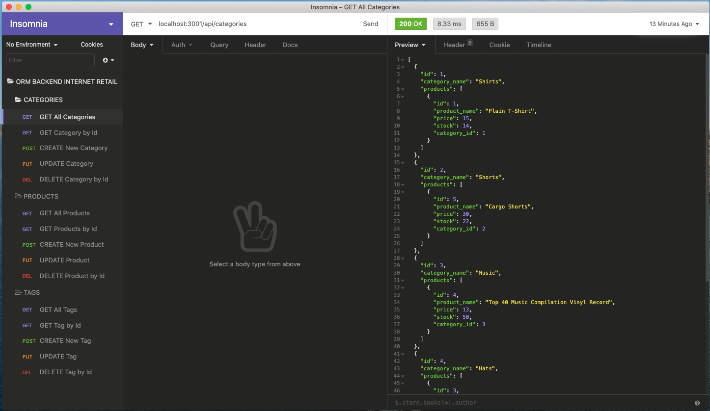
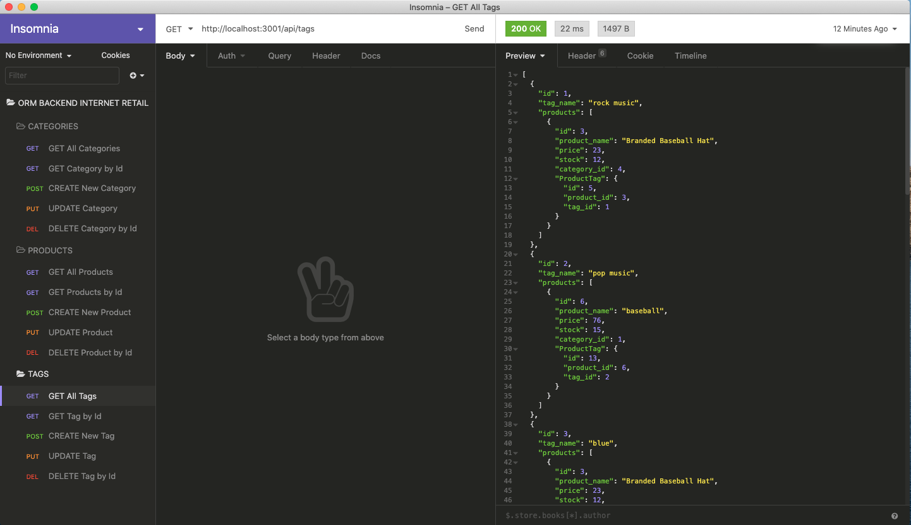
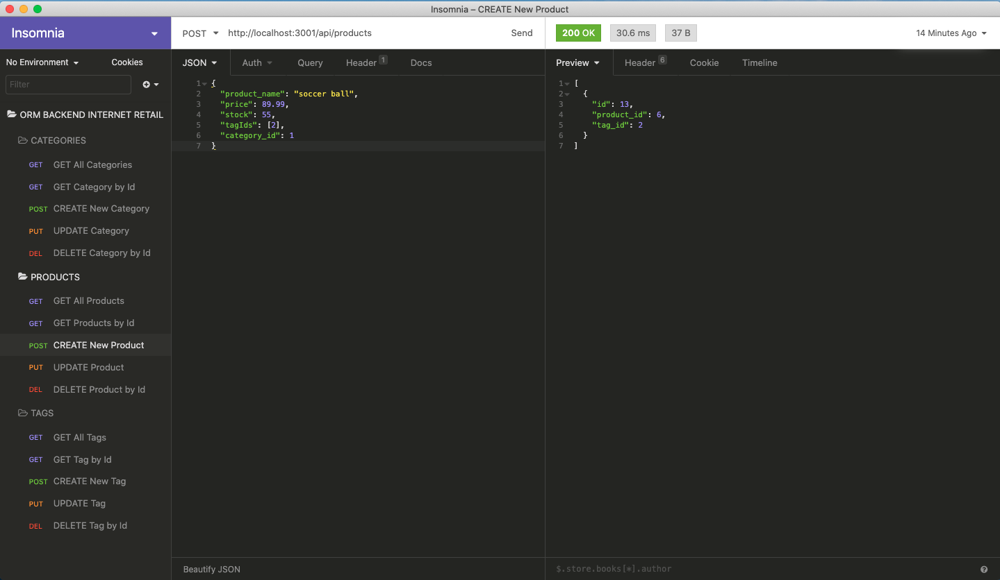
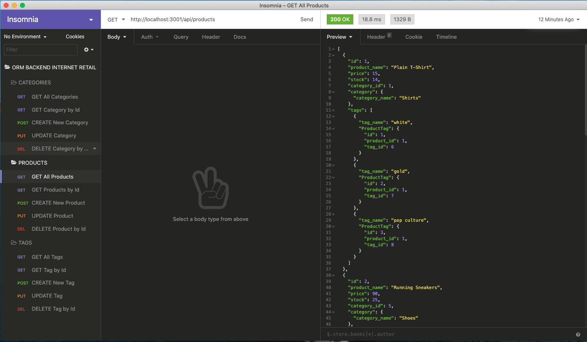
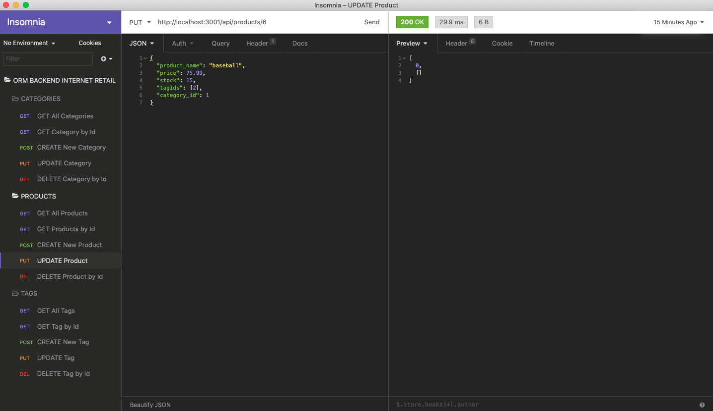
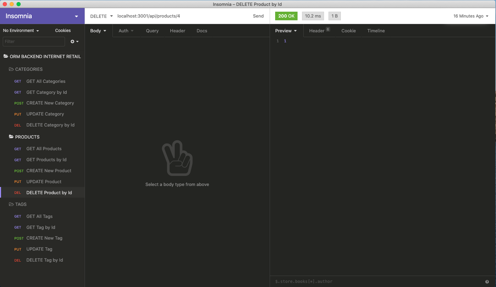

# E-commerce Back End

## Description
A manager at an internet retail company wants a back end for their e-commerce website that uses the latest technologies. This will allow the company to compete with other e-commerce companies.

## Table of Contents
* [Technologies](#technologies)
* [Screenshots](#screenshots)
* [Requirements](#requirements)
* [Links](#links)

## Technologies
1. JavaScript
2. Node.js
3. Express.js API
4. Sequelize
    * Object-Relational Mapping (ORM) tool was used to interact with the MySQL database

## Screenshots

# CRUD Screenshots

## Requirements
1. After being given the starter code, add MySQL username and password to an environment variable file that allows the user to connect to a database using Sequelize
2. Create the development database from the schema at the command line and then seed the test data for the internet retail company
3. Once that is completed, the CLI application can be invoked, the server is started and the Sequelize models are synced to the MySQL database
4. Using Insomnia Core, the user can open API GET routes for categories, products, or tags and the data for each of these routes is displayed in a formatted JSON
5. Lastly, the user can test API POST, PUT, and DELETE routes to successfully create, update, and delete data in the database

## Links
* [E-commerce Back End Walkthrough Video](https://drive.google.com/file/d/1h6v7Uxsdl-DN73fuqmgii8oYNg3JWUsR/view?usp=sharing)
* [E-commerce Back End Repository](https://github.com/bspiewak6/e-commerce_backend)

## License
  
This app is licensed under the MIT license.